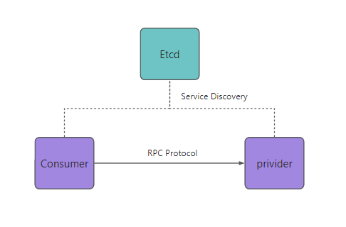
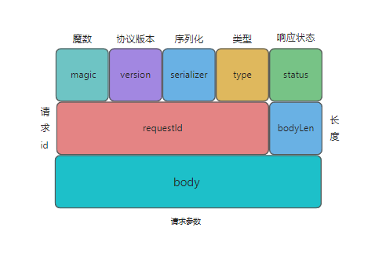

# BRPC项目
- 技术栈: JDK8(动态代理+反射)、Etcd、vert.x、Maven
- 适用性: 与 Dubbo 流程调用一致

## Architecture

## Feature
- 自动服务注册和发现
- 支持负载均衡(一致性hash算法)
- 支持服务重试
- 注册中心采用Etcd实现
- 支持多种序列化机制(JDK,JSON,KRYO,HESSIAN)

## Packet structure
- 自定义协议结构(类Dubbo)

## 示例项目

### 核心模块:
- brpc-spring-boot-starter
- example-spring-boor-provider
- example-spring-boot-consumer
- example-common

### 参考文档
- 下载核心模块 救赎之道就在其中

